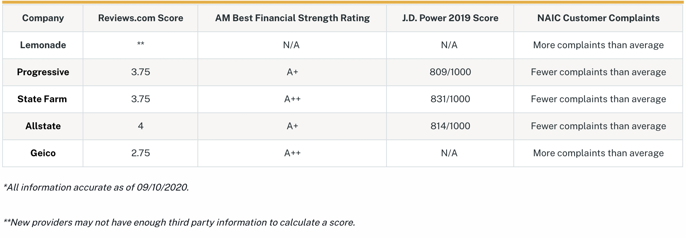
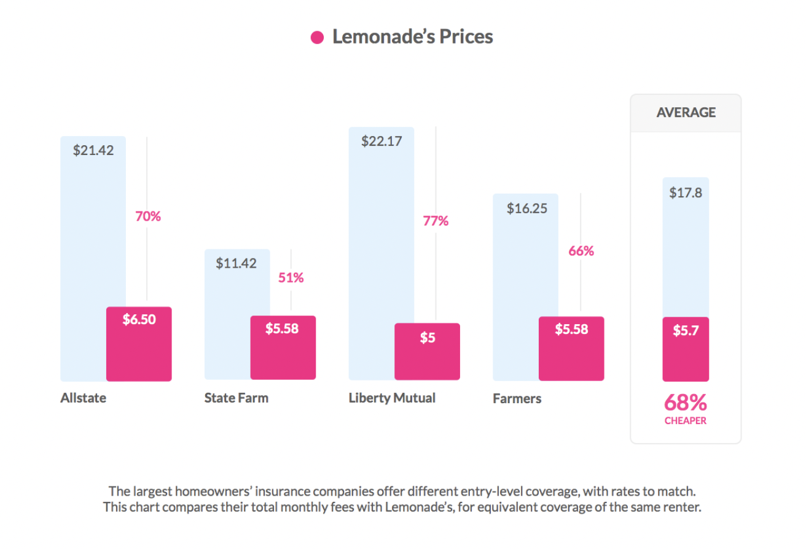

# Unit 1 Homework Assignment: FinTech Case Study

## Overview and Origin

- **Name of company**

*Lemonade, Inc.*

- **When was the company incorporated?**

*April 2015*

- **Who are the founders of the company?**

*Daniel Schreiber (CEO)*
  + *Daniel was an attorney prior to his entrepreneurship. He worked for a law firm before starting multiple start-ups, none of which panned out until Lemonade.*

*Shai Wininger (President & COO)*
  + *Shai has been an entrepreneur for some time and worked in the technology industry. He started multiple start-ups. Some failed, some succeeded.*

- **How did the idea for the company (or project) come about?**

*Daniel wanted to start a new business and came to the conclusion that the insurance industry hasn't changed much over time. The average age of an insurance company is more than 100 years. It's one of the oldest industries we know of — going back into the 1600s. It was time to disrupt and revolutionize the insurance industry. He knew almost nothing about how insurance worked, but knew that almost everybody will own some kind of insurance in their lifetime. He also knew that most people felt frustrated with their insurance, especially with the claims process. The goal was to make insurance attractive, interesting and easy. It shouldn't be a burden to get an insurance policy or receive a claim. Lemonade is changing the industry by using AI, machine learning and bots — partially removing the human factor.*

*90 seconds to get insured — meaning you get an insurance policy before your coffee order has been completed.*

- **How is the company funded? How much funding have they received?**

*Lemonade has gone through multiple rounds of funding. They started with seed funding from Sequoia Capital and Aleph for $13 million, and got their IPO in June 2020 totaling more than $600 million in funding. Their main investor is SoftBank Group, which holds about 27% of Lemonade.*

---

## Business Activities

- **What specific financial problem is the company or project trying to solve?**

*Lemonade’s aim is to reinvent the insurance industry by using state-of-the-art technology and simplifying the end-to-end process.*

- **Who is the company's intended customer?  Is there any information about the market size of this set of customers?**

*Lemonade’s customers are renters, homeowners and pet owners. At the beginning, their focus was on new customers who had never bought insurance before. This group made up about 85% of their customers; the remaining 15% came from competitors.*

- **What solution does this company offer that their competitors do not or cannot offer? (What is the unfair advantage they utilize?)**

*Lemonade tries to separate themselves by changing how insurance should work — focusing on the customer experience in ways their competitors don’t.*

- **Which technologies are they currently using, and how are they implementing them? (This may take a little bit of sleuthing–– you may want to search the company’s engineering blog or use sites like Stackshare to find this information.)**

*Big data and Machine Learning helps Lemonade to streamline the pricing module and also prevent 'unfair discrimination'. This can occur by forming specific groups into its own risk category. Changing the classification, risk groups and applying big data allows Lemonade to offer a more detailed insurance policy and pricing.*

*Lemonade is using smart algorithms to automate the claim handling process. This allows Lemonade to reduce the strains associated with the end-to-end process (Claim, investigation, fraud, filing and getting paid). Removing partially the human factor and fully automating the handling process can bring down the claim time from weeks to seconds.*

*Lemonade's most powerful employees are Maya (Virtual Assistant Bot) and Jim (AI Bot). However, Lemonade acknowledges that while AI and Machine Learning are powerful tools, they are not always flawless. Employees are still a key factor which will come to play when Maya and Jim hit road blocks.*

*Maya collects information, provides quotes, and handles the payments. She leverages early detection of catastrophes system to react to developing catastrophes in real-time. The bot automatically blocks areas and alerts Lemonade's human claims team of potential emergencies. Maya also helps the company to notify users of nearby fires and severe weather events as they develop. The more Maya chats, the smarter it gets as the Machine Learning models are retrained almost daily. Maya is fueled by NLP (Natural Language Processing) and NAS (Natural Action Synthesis).*

*Jim can read the nature of claims, their severity, and whether the customer is in a state of emergency. AI Jim also investigates the likelihood that a is dishonest. The bot even pushes people to be more honest by combining years of behavioral economics research into every tiny detail in the conversation.*

---

## Landscape

- **What domain of the financial industry is the company in?**

*InsurTech / Insurance Industry*

- **What have been the major trends and innovations of this domain over the last 5-10 years?**

*InsurTech is an entirely new business model that keeps evolving as companies find new ways to apply the latest technology tools such as big data, AI, machine learning and bots to simplify and speed up the insurance process. For instance, within the claim process, the industry has seen companies using drones for on-demand video inspection of potential claims/fraud investigations.*

*A big trend seen across most insurance companies is the implementation of bots to support the customer and guide them through the policy process as well as pin-point customers into the right direction to get their questions answered.*

*Mobile App support and moving from offline to online*

- **What are the other major companies in this domain?**

| InsureTech 	| Insurance   	|
|------------	|-------------	|
| Sure, Inc  	| AllState    	|
| Slice      	| Geico       	|
| Trov       	| State Farm  	|
|            	| Progressive 	|

---

## Results

- **What has been the business impact of this company so far?**

***1. Giveback:***

*The idea is very straight forward. Lemonade’s margin is based on a 25% flat fee for each signed policy. The remaining 75% are being used to pay claims. Everything remaining which has not been used to paid out claims gets donated to a charitable cause of policy holders’ choice within their policy category. Every year, Lemonade has able to donate to charitable causes more and more. The 2020 give back was almost double that of 2019 and is trending to increase as more customers join the Lemonade hype.*
  
***2. Claims Processing and Pricing/Policy Modeling:***

*Lemonade uniquely offers policies that are more tailored to each individual while also keeping costs down. This is a key factor that competitors will need to adopt. This is only possible by using today’s technology to reorganize the classic insurance company  infrastructure — essentially, going back to the drawing board and making the necessary changes to be and stay competitive.*

- **What are some of the core metrics that companies in this domain use to measure success? How is your company performing, based on these metrics?**

***Customer Satisfaction***

*This area is where Lemonade expects to perform outstanding. However, it seems that Lemonade is being outperformed by 50+ other insurance companies. This could also be due to the fact that Lemonade is new in the domain.*

***Pricing***

*No brokers or bureaucracy allows Lemonade to offer the same coverage as other competitors for less than half the cost. Keep in mind, however, that not all competitors are offering the same policy categories. Similar to how GEICO’s claim that 15 minutes can save up to 15% on car insurance,  Lemonade claims their customers can save 80% in 90 seconds.*

- **How is your company performing relative to competitors in the same domain?**

*Lemonade is still in the early stages of being a big player within the insurance industry, having a market share of less than 1%. However, early indications are showing that their new insurance model that utilizes Big Data, AI and machine learning is giving Lemonade an edge in pricing and processing — allowing them to offer custom policies at a lower cost.*

*Other competitors are also experimenting in AI-powered customer service, but Lemonade is leading the way in this strategy. However, when it comes to claims that require a human, which cannot be processed by Maya or Jim, it’s unclear what the customer experience is thereby affected by the lack of humans available.*

*Lemonade is expected to be perform better in customer relationship and satisfaction. However, it appears that other insurance providers are picking up the pace and performing equal or even better than Lemonade.*

---

## Recommendations

- **If you were to advise the company, what products or services would you suggest they offer? (This could be something that a competitor offers, or use your imagination!)**

*Lemonade only provides Renters and Homeowners insurance and just recently added Pet Insurance. Lemonade also expanded outside the US market to establish a business in Europe. Their focus should be to extend the business module further by adding additional policies and categories such as auto insurance as well as a broader rollout.*

*Further, I would re-evaluate the Giveback approach, recommending that the unused premiums be split between a charitable cause and the policy holders themselves. The possibility of cashing in might incentivize policy holders to think twice before filing a low-level claim.*

*Allowing customers to choose between AI or human support could open the market to an older generation. This will come with higher costs which could be allocated across all insurance categories, but would still net out cheaper than competitors. Offering the hybrid solution could increase customer satisfaction and decrease frustration.*

- **Why do you think that offering this product or service would benefit the company?**

*Adding additional insurance policies and categories allows the company to build their customer base. Currently, Lemonade is limited in their offering.*

*Re-evaluating the Giveback approach would encourage customers to critically asses the claims process. The possibility of cashing in might incentivize policy holders to think twice before filing a low-level claim.*

---

## Appendix - Research Material

### 1. Podcasts
* *[Dollars and Change Podcast - Lemonade Insurance with Daniel Schreiber](https://open.spotify.com/episode/23ZQ9XFK1LfvNUokVbBhDn?si=El0IdXLvQT6uIJG7DCZ91A)*
* *[The Insurance Innovators Unscripted Podcast - Ep 014: Daniel Schreiber – Lemonade and Insurance Innovation](https://open.spotify.com/episode/5ppkfeB4mlTy91NycuhTwl?si=pVbjVxa4RG2V6cgyDHqgxg)*
* *[Banking Transformed with Jim Marous - How Fintech Unicorn Lemonade is Disrupting Insurance](https://open.spotify.com/episode/6LSFS9nniWv2V5mkyPIOQi?si=3W561VMrT1-4qKZ5d2_syw)*

### 2. Websites
+ #### Lemonade
  + *[The Lemonade Transparency Chronicles](https://www.lemonade.com/blog/lemonade-transparency-chronicles/?utm_source=quora&utm_content=08_08_2017)*
  + *[Lemonade’s First Quarter in Market](https://www.lemonade.com/blog/lemonade-transparency-chronicles/?utm_source=quora&utm_content=08_08_2017)*
  + *[Saving 80% In 90 Seconds?](https://www.lemonade.com/blog/saving-80-90-seconds/)*
  + *[The Secret Behind Lemonade’s Instant Insurance](https://www.lemonade.com/blog/secret-behind-lemonades-instant-insurance/)*
  + *[Lemonade FAQ](https://www.lemonade.com/faq)*

+ #### Forbes
  + *[The Power Of Purpose: How Lemonade Is Disrupting Insurance With Goodness (And A New Foundation)](https://www.forbes.com/sites/afdhelaziz/2020/03/09the-power-of-purpose-how-lemonade-is-disrupting-insurance-with-goodness-and-a-new-foundation/?sh=1c3f828f7288)*
  + *[First, Fire All The Brokers: How Lemonade, A Millennial-Loved Fintech Unicorn, Is Disrupting The Insurance Business](https://www.forbes.com/sites/jeffkauflin/2019/05/02/lemonade-fintech-insurance-unicorn/?sh=7da4dd106cde)*
  + *[Lemonade IPO Shows The Power Of AI (Artificial Intelligence)](https://www.forbes.com/sites/tomtaulli/2020/07/03/lemonade-ipo-shows-the-power-of-ai-artificial-intelligence/?sh=3874271d3aeb)*

+ #### Others
  + *[How Lemonade Insurance Works](https://www.reviews.com/insurance/homeowners/how-lemonade-insurance-works/)*
  + *[Linkedin](https://www.linkedin.com/company/lemonade-inc-)*
  + *[Israeli-founded Lemonade insurance startup sets its sight on Europe](https://www.timesofisrael.com/israeli-founded-lemonade-insurance-startup-sets-its-sight-on-europe/)*
  + *[Don’t Believe The Hype – The Lemonade Story](https://insnerds.com/lemonade-hype/)*
  + *[Three insurtech trends to watch in 2020](https://www.fintechmagazine.com/fraud-and-cybersecurity/three-insurtech-trends-watch-2020)*
  + *[Lemonade claims to have fastest-growing segment of NY renters market](https://www.insurancebusinessmag.com/us/news/technology/lemonade-claims-to-have-fastestgrowing-segment-of-ny-renters-market-71108.aspx)*
  + *[Lemonade Homeowners Insurance Review](https://www.reviews.com/insurance/homeowners/lemonade-review/)*
  + *[The Lemonade Insurance Business Model – How Does Lemonade Insurance Work & Make Money?](https://productmint.com/the-lemonade-insurance-business-model-how-does-lemonade-insurance-make-money/#:~:text=Shai%20Wininger%20and%20Daniel%20Schreiber,start%20an%20internet%20security%20company.)*
  + *[Owler](https://www.owler.com/company/lemonade)*
  + *[Wikipedia](https://en.wikipedia.org/wiki/Lemonade,_Inc.)*
  + *[The S-1 Club | Is Lemonade more than another SoftBank growth-machine?](https://thegeneralist.substack.com/p/the-s-1-club-is-lemonade-more-than)*
  + *[How Machine Learning generated $100M in 2.5 years for an insurance company?](https://arekskuza.com/the-innovation-blog/machine-learning-startup-lemonade/#:~:text=Lemonade%20was%20born%20with%20Machine,thereby%20quoting%20a%20relevant%20premium.&text=They%20are%20compiled%20by%20AI,data%20and%20monitor%20loss%20ratios)*
  + *[How is machine learning/artificial intelligence affecting the insurance industry?](https://www.quora.com/How-is-machine-learning-artificial-intelligence-affecting-the-insurance-industry)*
  + *[How do insurance companies use machine learning?](https://www.quora.com/How-do-insurance-companies-use-machine-learning)*
  + *[Stackshare](https://stackshare.io/companies/lemonade)*

