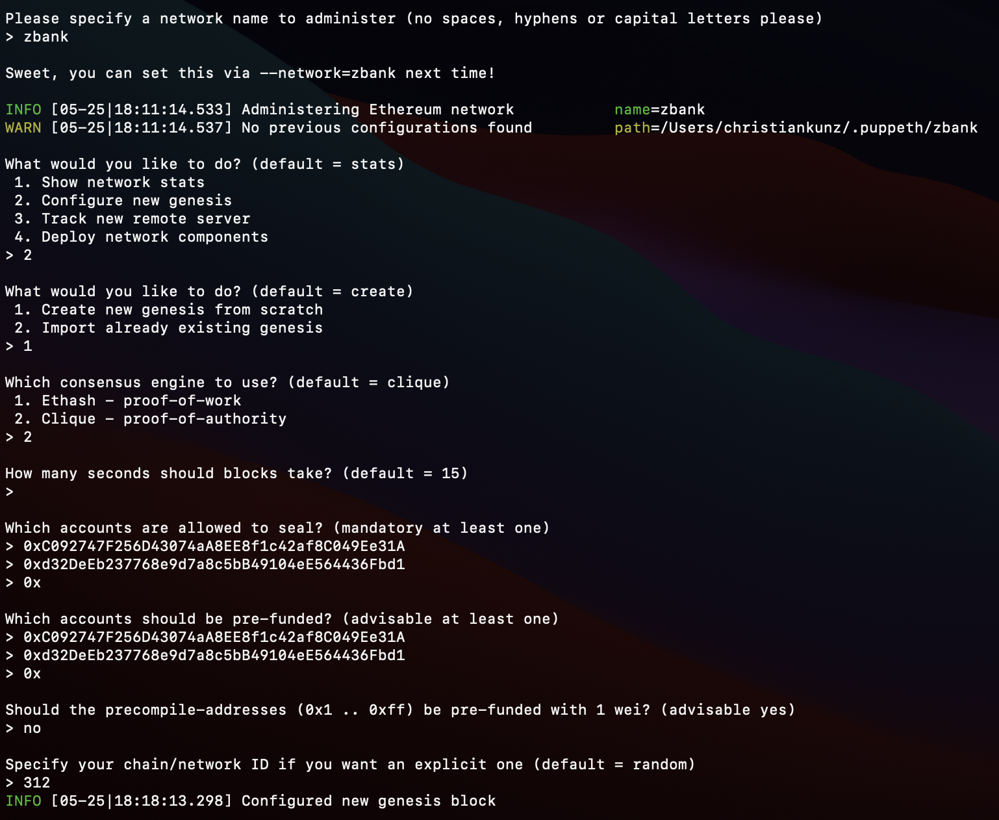
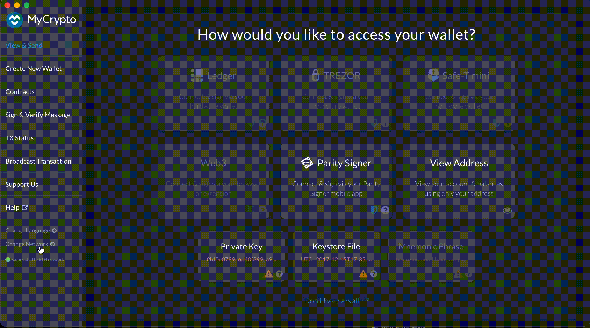
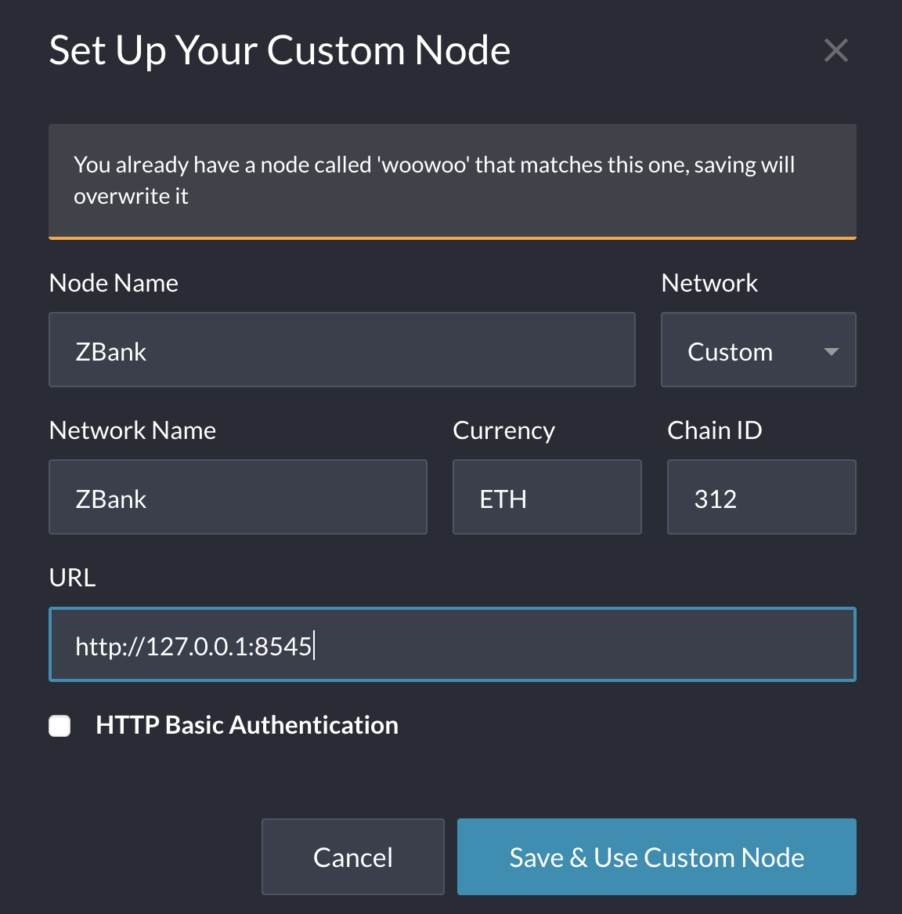
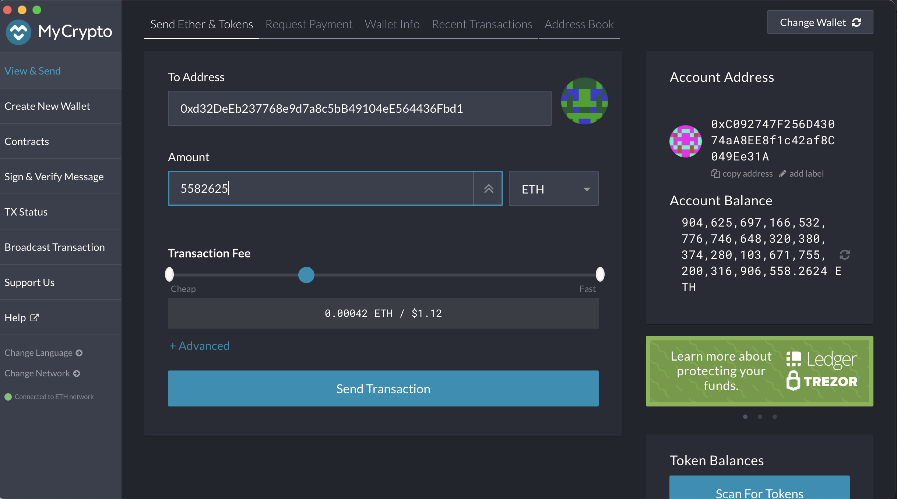
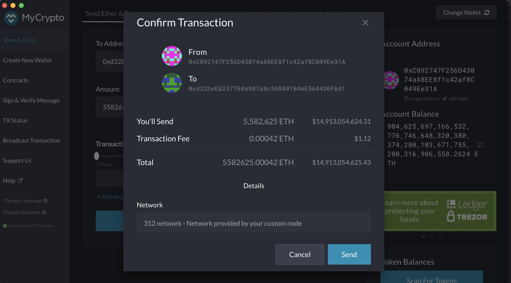
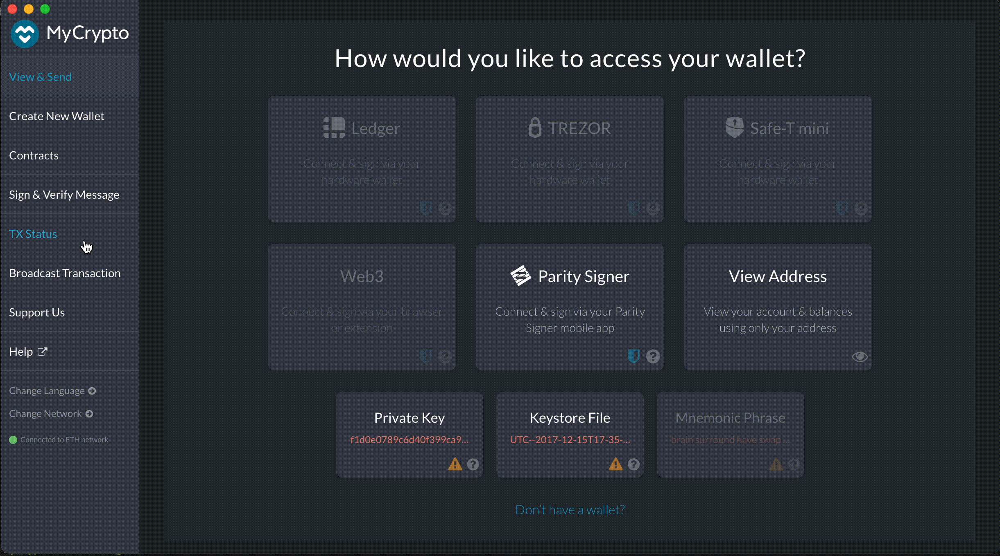

# Running a Proof of Authority Blockchain

The Proof of Authority (PoA) algorithm is typically used for private blockchain networks as it requires pre-approval of, or voting in of, the account addresses that can approve transactions (seal blocks).  

---

## Background

For this assignment, you will take on the role of a new developer at a small bank.

Your mission, should you choose to accept it, will be to set up a testnet blockchain for your organization.

You have just landed a new job at ZBank, a small, innovative bank that is interested in exploring what
blockchain technology can do for them and their customers.

Your first project at the company is to set up a private testnet that you and your team of developers
can use to explore potentials for blockchain at ZBank.

---

0. Before we get started - Please ensure you have the following packages downloaded and installed

    * Go Ethereum 
    * MyCrypto

Read more [here](Resources/blockchain-install-guide.md) !

1. Because the accounts must be approved, we will generate two new nodes with new account addresses that will serve as our pre-approved sealer addresses.

    * Create accounts for two nodes for the network with a separate `datadir` for each using `./geth`.
        ```
        ./geth --datadir ZBank_node1 account new
        ./geth --datadir ZBank_node2 account new
        ```

        * **NOTE:** Store Public address of the key and Path of the secret key file for each ZBank_node into a save location!
        
        ```
        ZBank_node1
        Public address of the key: 
        0xC092747F256D43074aA8EE8f1c42af8C049Ee31A

        Path of the secret key file: ZBank_node1/keystore/UTC--2021-05-25T22-59-28.505321000Z--c092747f256d43074aa8ee8f1c42af8c049ee31a

        ZBank_node2
        Public address of the key:   0xd32DeEb237768e9d7a8c5bB49104eE564436Fbd1

        Path of the secret key file: ZBank_node2/keystore/UTC--2021-05-25T23-00-37.203124000Z--d32deeb237768e9d7a8c5bb49104ee564436fbd1
        ```
2. Next, generate your genesis block.

    * Open your Terminal and navigate into the location of your Blockchain-Tools. 
    Run `./puppeth`, name the network `zbank`, and select the option to configure a new genesis block.

        ```
        ./puppeth
        ```

    * Please spcify a network name to administer
        * `zbank`

    * What would you like to do?
        * `2. Configure new genesis`

    * Which consensus engine to use?
        * `2. Clique - proof-of-authority`

    * How many second should block take?
        * click `return` (default of 15 will be used)
    
    * Which accounts are allowed to seal?
        * Paste both account addresses from the first step one at a time into the list of accounts to seal.

            ```
            ZBank_node1: 0xC092747F256D43074aA8EE8f1c42af8C049Ee31A
            ZBank_node2: 0xd32DeEb237768e9d7a8c5bB49104eE564436Fbd1
            ```
    
    * Which accounts should be pre-funded?
        * Paste them again in the list of accounts to pre-fund. There are no block rewards in PoA, so you'll need to pre-fund.

    * Should the precompile-addresses (0x1 ..0xff) be pre-funded with 1 wei?
        * `no` (this keeps the genesis cleaner)

    * Specify your chain/netwrok ID if you want an explicit one
        * `312`
    
    * What would you like to do?
        * 2. Manage existing genesis
             * 2. Export genesis configurations
    
    * Which folder to save the genesis specs into?
        zbank (this will create a new folder zbank and export the genesis configurations files. `zbank.json` file will be used going forward.)

        Once conpleted exit the configuration with `control + C`
    
        

3. With the genesis block creation completed, we will now initialize the nodes with the genesis `zbank.json` file.

    * If you closed your Terminal - open the Terminal back up and navigate into the location of your Blockchain-Tools. 

    * Using `geth`, initialize each node with the new `zbank.json`.
        * ./geth --datadir ZBank_node1 init zbank.json
        * ./geth --datadir ZBank_node2 init zbank.json

4. Now the nodes can be used to begin mining blocks. Run the nodes in separate terminal windows with the commands

    *  ./geth --datadir ZBank_node1 --unlock "C092747F256D43074aA8EE8f1c42af8C049Ee31A" --mine --miner.threads 1 --rpc --allow-insecure-unlock
        * **NOTE:** Type your password `ZBank` and hit enter - even if you can't see it visually!
        
    Open the second Terminal and navigate into the location of your Blockchain-Tools.
    *  ./geth --datadir ZBank_node2 --unlock "d32DeEb237768e9d7a8c5bB49104eE564436Fbd1" --mine --port 30304 --bootnodes "enode://16a267f07f3149f2d2de5bffe87a1080156d8c064ddcd4dd05b020c01ca2e977f1f387a0dbd018a5237ff1a9564222ef374ffb1417c88510e1e76c1296ed2b49@127.0.0.1:30303" --ipcdisable --allow-insecure-unlock
        * **NOTE:** Type your password `ZBank` and hit enter - even if you can't see it visually!

    ```
    --mine: sets the node to mine new blocks
    --miner.threads 1: set the number of CPU threads to be used during mining. Lower -> High difficulity
    --unlock: unlocks the node
    --rpc: allows the node to communciate through the web
    --allow-insecure-unlock: allows to unlock the node in an insecure mananer
    ```

5. Your private PoA blockchain should now be running!

6. With both nodes up and running, the blockchain can be added to MyCrypto for testing.

    

    * Open the MyCrypto app, then click `Change Network` at the bottom left:

    * Click `+ Add Custom Node`

    * Set Up Your Custom Node
        * Network: `Custom`
        * Node Name: `ZBank`
        * Network Name: `ZBank`
        * Currency: `ETH`
        * Chain ID: `312`
            * This is the chain/netwrok ID we created with our Terminal during the genesis creation.
        * URL: `http://127.0.0.1:8545`
            * This points to the default RPC port on your local machine.

    * `Click Save & Use Custom Node`

    


7. After connecting to the custom network in MyCrypto, it can be tested by sending money between accounts.

* Open your ZBank_node1 account wallet inside MyCrypto. 
    * Select the `View & Send` option from the left menu pane, then click `Keystore File`.

    * On the next screen, click `Select Wallet File`, then navigate to the keystore directory inside your ZBank_node1 directory, select the file located there, provide your password `ZBank` when prompted and then click `Unlock`.  

    

    * In the `To Address` box, type the account address from ZBank_node2, then fill in an arbitrary amount of ETH:
        ```
        To Address: 0xd32DeEb237768e9d7a8c5bB49104eE564436Fbd1
        Amount: 5582625
        ```

        `Sent Transaction`

        * AND

        `Send`

    

    

    * You should see the transaction go from `Pending` to `Successful` in around the same blocktime (we selected the default with `15`) you set in the genesis.

    * You can click the `Check TX Status` button to view the status of the transaction.
    
    